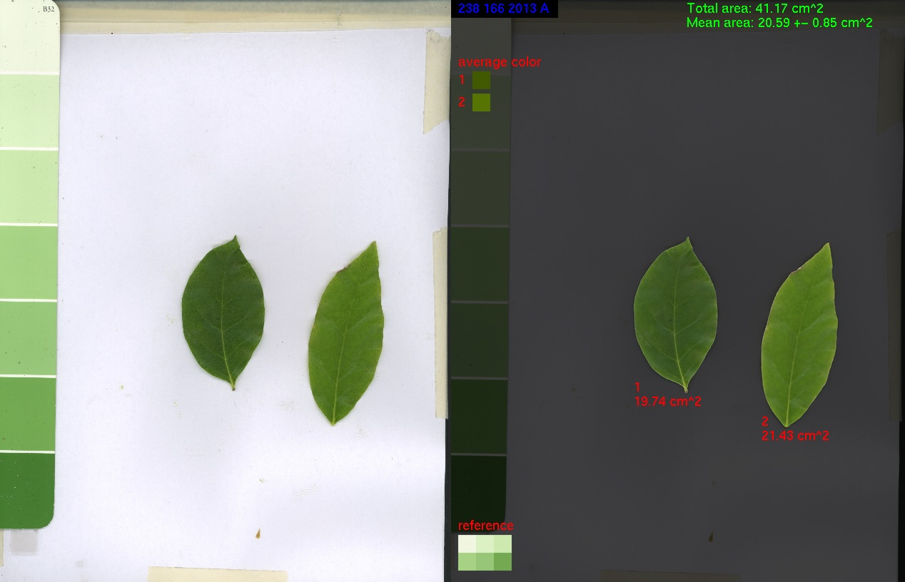

# LeafAreaExtraction

**LeafAreaExtraction** is a Python script designed to calculate the leaf area from scanned leaf images.



## Features

- **Automatic Thresholding**: Utilizes Otsu's method for image binarization to distinguish leaves from the background.
- **Batch Processing**: Supports processing multiple images within a specified directory.
- **Customizable Background**: Offers options to handle images with black backgrounds.
- **Summary Generation**: Provides a summary of the calculated leaf areas.

## Prerequisites

Ensure you have the following Python libraries installed:

- `numpy`
- `Pillow` (PIL Fork)
- `scipy`

You can install them using pip:

```bash
pip install numpy pillow scipy
```

## Usage

To run the script, use the following command:

```bash
python leafArea.py <InputPath>
```

Where `<InputPath>` can be:

- A directory containing multiple image files.
- A single image file.

### Additional Flags

- `-F`: Force overwrite of existing files.
- `-black`: Specify if the images have a black background.
- `-sum`: Produce a summary only.

### Example

To process all images in the 'demo' directory:

```bash
python leafArea.py demo
```

## Notes

- The script attempts to retrieve the DPI (dots per inch) information from the image metadata. If unavailable, a default value is used.
- It employs Otsu's method for image binarization to separate the leaf from the background.
- The calculated leaf area is based on the number of pixels corresponding to the leaf, adjusted for the image's DPI to provide a real-world measurement.

## Copyrights

The `pilfonts` folder contains a subset of the [pilfonts](http://effbot.org/downloads#pilfonts) collection from EFFBot, which are based on X11 fonts. Please refer to the [pilfonts/README](LeafArea/pilfonts/README) file for copyright details.
